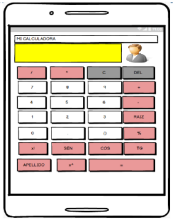
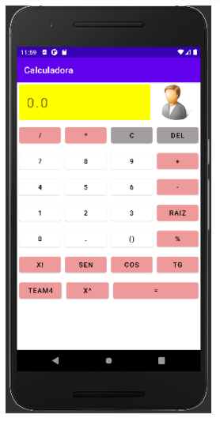

# Calculadora Android :abacus:

Tecnologías utilizadas:

- mXparser v5
- Android Studio 2021.1.1
- Android SDK Tools 24.2
- JDK 1.8.0

---

> Esta aplicación fue realizada como tarea del curso de Aplicaciones Moviles

Esta aplicación puede:

- **Obtener el resultado de cualquier expresión matemática escrita**
- **Diseño del profesor hecho en Balsamiq**

**Despliegue en un emulador Pixel 4**

